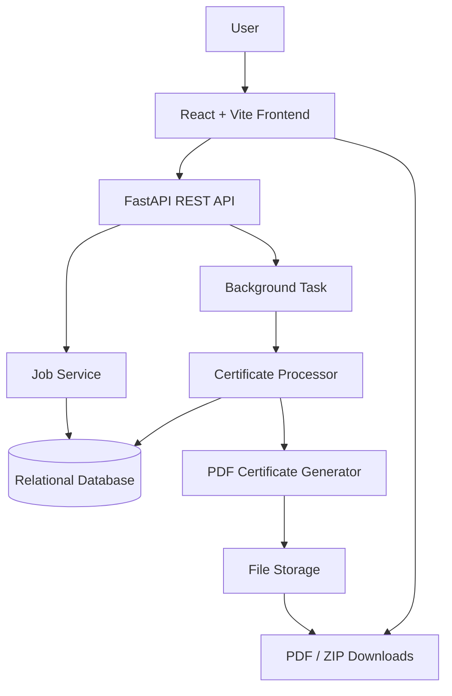
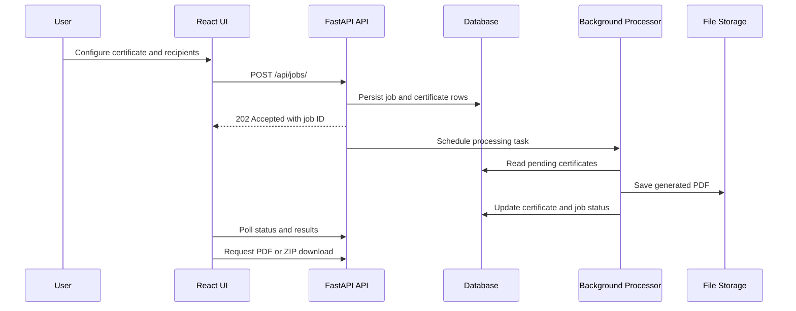

# CertBatcher

> A bulk certificate generation platform built with FastAPI and React that validates recipients, generates personalized PDF certificates, tracks processing progress, and supports individual or ZIP downloads.

## Overview

CertBatcher helps organizations generate certificates for a group of recipients
without manually creating each document. A user can enter recipients manually
or import them from Excel/CSV, configure certificate metadata and custom
recipient fields, then submit one job for processing.

Each recipient becomes an independently tracked certificate record. Invalid
rows are retained as failures instead of stopping the whole job, while valid
rows are processed in the background. Users can monitor status and counts,
inspect successful or failed rows, download individual PDFs, or download all
available PDFs as a ZIP archive.

## Features

- Bulk certificate generation
- Manual recipient entry
- Browser-side `.xlsx`, `.xls`, and `.csv` import
- Dynamic recipient fields with `text`, `email`, `number`, and `date` types
- Required and optional custom fields
- Per-recipient validation and failure isolation
- Personalized ReportLab PDF generation
- Background processing with FastAPI `BackgroundTasks`
- Job status and progress counts
- `PENDING`, `SUCCESS`, and `FAILED` certificate results
- `COMPLETED`, `COMPLETED_WITH_ERRORS`, and `FAILED` job states
- Dashboard search across name, email, and dynamic values
- Result filtering by all, successful, failed, or pending
- Individual PDF downloads
- ZIP downloads containing successful generated PDFs
- Responsive React interface
- REST API for job creation, status, results, and downloads
- SQLite development support
- PostgreSQL-compatible SQLAlchemy configuration
- Filesystem-backed PDF storage with path-containment checks

## Architecture

### Frontend

The React + Vite frontend provides:

- certificate metadata entry
- dynamic field configuration
- manual recipient entry
- Excel/CSV upload and preview
- job progress polling
- result search and filtering
- PDF and ZIP download actions

### API

FastAPI exposes the health check and job lifecycle endpoints. The API validates
the request shape, persists the job and certificate rows, and schedules
background processing after accepting a valid job request.

### Job service

The job service creates one `Certificate` row for every submitted recipient.
Recipient validation is performed independently, so an invalid row can be
marked `FAILED` without affecting other rows.

### Database

SQLAlchemy persists relational job and certificate metadata. SQLite is the
default local database; the SQLAlchemy setup also accepts PostgreSQL URLs.

### Background processor

The processor opens its own database session, generates PDFs for pending
certificates, stores successful files, records errors for failed certificates,
and finalizes the job status from the resulting certificate counts.

### Certificate generator

ReportLab creates landscape A4 PDFs containing the certificate title, event,
recipient name, issuer, date, certificate ID, and any configured dynamic
recipient values.

### File storage

Generated files are stored at:

```text
<storage directory>/<job id>/<certificate id>.pdf
```

Download paths are resolved and checked to ensure they remain inside the
configured storage directory.

## Architecture diagram



## Processing flow



## Technology stack

### Backend

- Python 3.12+
- FastAPI
- Uvicorn
- Pydantic v2 and `pydantic-settings`
- SQLAlchemy 2
- SQLite by default
- PostgreSQL support through `psycopg`
- ReportLab

### Frontend

- React 18
- Vite
- SheetJS (`xlsx`) for browser-side spreadsheet parsing

### Development and testing

- pytest
- HTTPX
- Ruff
- pypdf

## Project structure

```text
.
├── app/
│   ├── api/
│   │   └── jobs.py                  # Job and download endpoints
│   ├── services/
│   │   ├── archive.py                # In-memory ZIP creation
│   │   ├── certificate_generator.py  # ReportLab PDF generation
│   │   ├── job_service.py            # Job and certificate persistence
│   │   ├── processor.py              # Background certificate processing
│   │   └── storage.py                # Filesystem storage and path checks
│   ├── config.py                    # Environment-backed settings
│   ├── database.py                  # SQLAlchemy engine and sessions
│   ├── dependencies.py              # FastAPI dependencies
│   ├── main.py                      # FastAPI application and CORS
│   ├── models.py                    # Job and Certificate models
│   └── schemas.py                   # Request, response, and validation models
├── frontend/
│   ├── src/
│   │   ├── services/api.js           # API client
│   │   ├── App.jsx                   # Main UI and workflow
│   │   └── styles.css                # Application styling
│   ├── package.json
│   └── vite.config.js
├── test-data/                        # Reproducible spreadsheet fixtures
├── tests/                            # Backend unit and integration tests
├── .env.example
├── pyproject.toml
├── requirements.txt
└── requirements-dev.txt
```

## Database design

The application has two primary tables:

### `jobs`

Stores certificate metadata and job lifecycle information:

- job ID and status
- certificate title, event name, issuer, and issue date
- total recipient count
- JSON field definitions
- created, started, and finished timestamps
- job-level error information

### `certificates`

Stores one result row per submitted recipient:

- certificate ID and owning job ID
- original submission row index
- recipient name and optional email
- JSON `raw_data` for submitted or normalized dynamic values
- certificate status and error message
- relative PDF path
- creation and generation timestamps

Certificate rows are ordered by `row_index` when results are returned. A
unique constraint prevents duplicate row indexes within a job, and an index
supports job/status lookups.

At application startup, SQLAlchemy runs `Base.metadata.create_all()`. This is
suitable for the current local application; production deployments should use
a proper migration workflow when evolving an existing database schema.

## API

The API is served at `http://127.0.0.1:8000` by default.

| Method | Endpoint | Purpose |
| --- | --- | --- |
| `GET` | `/health` | Returns `{"status": "ok"}` |
| `POST` | `/api/jobs/` | Validates and creates a certificate job |
| `GET` | `/api/jobs/{job_id}/` | Returns job status, counts, timestamps, and field definitions |
| `GET` | `/api/jobs/{job_id}/certificates/` | Returns certificate results in submission order |
| `GET` | `/api/jobs/{job_id}/certificates/{certificate_id}/download` | Downloads one successful PDF |
| `GET` | `/api/jobs/{job_id}/download` | Downloads all available successful PDFs as a ZIP |

### Create a job

`POST /api/jobs/` returns `202 Accepted` after the job and certificate rows
have been persisted. The request must contain a certificate definition and a
non-empty recipient list. The configured maximum is 1,000 recipients by
default.

```json
{
  "certificate": {
    "title": "Certificate of Completion",
    "event_name": "Python Workshop",
    "issued_by": "ABC Academy",
    "issue_date": "2026-10-01"
  },
  "fields": [
    {
      "key": "score",
      "label": "Score",
      "type": "number",
      "required": true
    },
    {
      "key": "completed_on",
      "label": "Completed on",
      "type": "date",
      "required": false
    }
  ],
  "recipients": [
    {
      "name": "Alice Johnson",
      "email": "alice@example.com",
      "data": {
        "score": 98.5,
        "completed_on": "2026-09-30"
      }
    }
  ]
}
```

Example:

```bash
curl -X POST http://127.0.0.1:8000/api/jobs/ \
  -H "Content-Type: application/json" \
  -d @job.json
```

### Check status and results

```bash
curl http://127.0.0.1:8000/api/jobs/<job-id>/
curl http://127.0.0.1:8000/api/jobs/<job-id>/certificates/
```

The status response includes total, succeeded, failed, and pending counts.
Certificate results include recipient information, status, errors, file paths,
generation timestamps, and dynamic `data`.

### Download generated files

```bash
curl -OJ \
  http://127.0.0.1:8000/api/jobs/<job-id>/certificates/<certificate-id>/download

curl -OJ \
  http://127.0.0.1:8000/api/jobs/<job-id>/download
```

Individual downloads require a successful certificate whose file still exists.
ZIP archives include only successful certificates with available PDF files. If
no generated certificate is available, the API returns a conflict response.

## Dynamic fields

Each job can define up to 20 custom fields. A field has:

- `key`: lowercase identifier matching `^[a-z][a-z0-9_]{0,39}$`
- `label`: display label
- `type`: `text`, `email`, `number`, or `date`
- `required`: whether each recipient must provide a value

Custom keys must be unique and cannot replace the first-class `name` and
`email` fields. Dynamic values are sent under each recipient's `data` object.
The backend normalizes numbers and ISO dates, validates custom emails, and
stores the resulting values in the certificate JSON data.

Dynamic values are rendered below the event name in generated PDFs and are
returned in certificate results. Long values use bounded wrapping and the
generator renders only configured, non-empty values.

## Excel and CSV import

The frontend parses files in the browser. Supported formats are:

- `.xlsx`
- `.xls`
- `.csv`

Import behavior:

- the first worksheet is used for Excel files
- files are limited to 5 MB
- `name` and `email` columns are required
- `name` and `email` matching is case-insensitive
- custom fields can match configured keys or labels
- spaces and punctuation in headers are normalized for matching
- completely empty rows are ignored
- duplicate rows are preserved
- all imported rows are previewed before submission
- frontend validation provides immediate feedback
- backend validation remains authoritative

Example CSV:

```csv
name,email,score,completed_on
Alice Johnson,alice@example.com,98.5,2026-09-30
Bob Smith,bob@example.com,87,2026-10-01
```

Rows with missing or invalid data remain visible and are recorded as failed
certificate rows without preventing valid rows from being processed.

## Frontend workflow

1. Enter certificate title, event name, issuer, and issue date.
2. Add optional custom fields and mark fields as required when needed.
3. Choose manual entry or Excel/CSV upload.
4. Enter or preview recipient rows.
5. Submit the job.
6. Monitor progress and status counts.
7. Search or filter certificate results.
8. Download successful PDFs individually or as a ZIP.

The frontend defaults to `http://127.0.0.1:8000` for the API and polls the job
status while processing is active. The backend CORS configuration allows the
local Vite origins `http://localhost:5173` and
`http://127.0.0.1:5173`.

## Configuration

Copy `.env.example` to `.env` and adjust the values:

| Variable | Default | Description |
| --- | --- | --- |
| `DATABASE_URL` | `sqlite:///./certgen.db` | SQLAlchemy database URL |
| `STORAGE_DIR` | `./storage` | Root directory for generated PDFs |
| `MAX_RECIPIENTS_PER_JOB` | `1000` | Maximum recipients accepted in one job |

The frontend API URL can be changed independently with
`frontend/.env`:

```bash
VITE_API_BASE_URL=http://127.0.0.1:8000
```

## Installation and local development

### Backend

Python 3.12 or newer is required by `pyproject.toml`.

Windows PowerShell:

```powershell
py -3.12 -m venv .venv
.venv\Scripts\Activate.ps1
python -m pip install -r requirements-dev.txt
Copy-Item .env.example .env
uvicorn app.main:app --reload
```

Linux/macOS:

```bash
python3.12 -m venv .venv
source .venv/bin/activate
python -m pip install -r requirements-dev.txt
cp .env.example .env
uvicorn app.main:app --reload
```

The backend listens on `http://127.0.0.1:8000`.

### Frontend

In a second terminal:

```bash
cd frontend
npm install
npm run dev
```

The Vite development server is normally available at
`http://127.0.0.1:5173`.

For a production frontend bundle:

```bash
npm run build
```

## Testing and quality checks

From the repository root:

```bash
python -m pytest -q
python -m ruff check .
```

The test suite covers schemas and validation, job creation, status handling,
failure isolation, PDF generation, downloads, storage path protection,
configuration, models, and dynamic fields.

## Limitations

- Processing uses FastAPI `BackgroundTasks`; it is intended for local and
  modest workloads, not a distributed job queue.
- There is no authentication or authorization layer in the current API.
- The current certificate layout is a fixed ReportLab template rather than a
  user-editable design system.
- Dynamic fields are defined per job and cannot be edited after job creation.
- Existing databases created before the `field_definitions` column was added
  require a migration or recreation before using dynamic-field jobs.
- Browser spreadsheet parsing depends on `xlsx` 0.18.5. The current package
  audit reports known prototype-pollution and ReDoS advisories with no
  available upstream fix.
- The frontend currently supports local Vite origins through the backend CORS
  configuration rather than a configurable production allowlist.

## Future improvements

- Add database migrations with Alembic.
- Move processing to a durable queue and worker system.
- Add authentication, authorization, and tenant isolation.
- Add configurable certificate templates and branding.
- Add object storage support for generated files.
- Add job cancellation, retries, and retention policies.
- Add deployment documentation and production observability.
